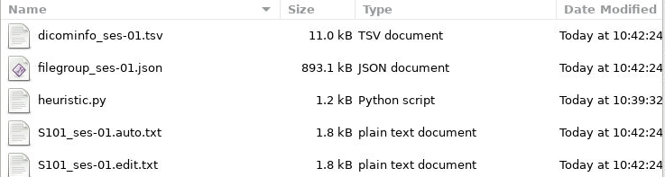
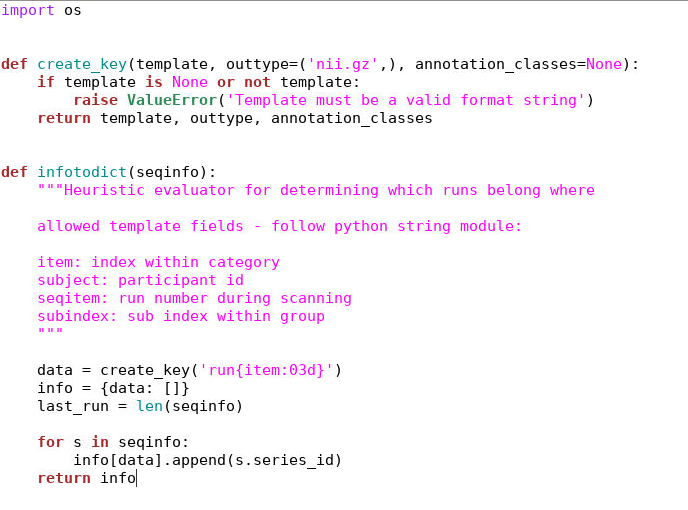

HeuDiConv
================================

HeuDiConv stands for Heuristic Dicom Converter and is a flexible pipeline for
converting DICOMs to a BIDS formatted data structure. Using dcm2niix, conversion
to the nifti formmat is fast and requires minimal user input. This document aims
to instruct users on how to install and use HeuDiConv on the Cheaha computing
cluster. HeuDiConv's full documentation is outdated but can be found `here for
further information <https://heudiconv.readthedocs.io/en/latest/index.html>`__.

Installation
-------------------------------

There are multiple methods to install Heudiconv including as a Python library or
as a standalone Singularity container. How you interface with Heudiconv changes
slightly based on how you install it, but both installation methods will be
covered here.

As a Python Library
^^^^^^^^^^^^^^^^^^^^^^^^^^^^^^^

First, load an Anaconda module on Cheaha and create a virtual environment. From
there, you can use ``pip`` to install the Heudiconv like:

.. code-block:: bash

    module load Anaconda3/2020.11
    
    # create and/or activate your virtual environment here

    pip install heudiconv[all]

This will download the latest version of Heudiconv. After installation, you can use the library through the ``heudiconv`` command.

As a Container
^^^^^^^^^^^^^^^^^^^^^^^^^^^^^^^

Containers are stand-alone instances that provide all the necessary dependencies
for a given program out-of-the-box so no management of external programs is
required. Using this method, you will download a Singularity image file
containing Heudiconv and all of its dependencies in a single location in your
personal user space or a shared lab project space. More information on using
Singularity containers can be found at their `documentation
<https://sylabs.io/guides/3.8/user-guide/>`__.

In order to use Singularity on Cheaha, you will need to load the module. You
only need to load the module once when opening a new terminal window or in a job
submission script. The command to load the latest version of Singularity
installed on the cluster is:

.. code-block:: bash

    module load Singularity

To load a specific version, use ``module spider Singularity`` to view all
installed Singularity modules and load the one you want.

The container for Heudiconv can be found on their `DockerHub page
<https://hub.docker.com/r/nipy/heudiconv>`__, and the source code can be found
on their `github page <https://github.com/nipy/heudiconv>`__. Currently, the
latest working Singularity container is version 0.5.4.

To begin, open a terminal window on Cheaha either through the HPC Desktop portal
at `<rc.uab.edu>`__ or through your own personal VNC session. If you are working
through a personal VNC session, be sure to start an interactive session in your
terminal first to avoid running anything on the login node. 

To pull and build the latest version of Heudiconv, run the following commands:

.. code-block:: bash
    
    singularity build $USER_DATA/heudiconv-0.5.4.sif docker://nipy/heudiconv:0.5.4

This command will build Heudiconv version 0.5.4 from DockerHub, convert it to a
singularity image, and save it in your user data folder as heudiconv-0.5.4.sif.
Modify the output path as you see fit to save it where you need it. The download
and conversion process will take some time, so be patient while everything runs.

Initial Folder Structure
------------------------------------

Once the Singularity image has been downloaded, make sure your DICOM files are
organized consistently across the project you are converting. For instance, a
preferred organization is:

.. code-block:: text

    |-- dataset/
        |-- dicom
        |   |-- S101/
        |   |   |-- [ses-01/]
        |   |   |   |-- scan-01/
        |   |   |   |   |-- ***001.dcm
        |   |   |   |   |-- ***002.dcm
        |   |   |   |   |-- ...
        |   |   |   |
        |   |   |   |-- scan-02/
        |   |   |       |-- ***.dcm
        |   |   |
        |   |   |-- [ses-02/]
        |   |
        |   |-- S102/
        |   |
        |   |-- S103/
        |
        |-- nifti (empty)

Inclusion of the session directory level is optional if there is only one
session per participant. The names of the dicom files themselves do not need to
be altered in any way before running Heudiconv.

If your data is stored in a different format but has a consistent structure
across all files, this is fine. It is just important that the subject name as
well as session number (if multiple sessions were acquired) are easily extracted
from the file path.

Running HeuDiConv
-----------------------------------

In the following example, we will use the given directory structure above. The
dataset will be named ``D01``, and it's parent directory will be
``/data/project/genlab/datasets`` to mimic a generic project directory found on
Cheaha. 

Step 1: Generate Scan Info
^^^^^^^^^^^^^^^^^^^^^^^^^^^^^^^^^^^

.. note::
    If you already have a heuristic file to use with your dataset, skip to Step 3.

The first step in Heudiconv generates a hidden directory with information about
each scan found in the given subject and session folder you specify. This
information will be used to create what is called a heuristic file which will be
covered later.

**Python:**

.. code-block:: bash

    # set the base dataset directory
    BASE_DIR=/data/project/genlab/datasets/D01

    heudiconv -s S101 -ss 01 -d $BASE_DIR/dicom/{subject}/ses-{session}/*/*.dcm -o $BASE_DIR/nifti -f convertall -c none --overwrite

**Singularity:**

.. code-block:: bash

    singularity run --bind /data/project/genlab/datasets/D01:/base
    $USER_DATA/heudiconv-0.5.4.sif -s S101 -ss 01 -d
    /base/dicom/{subject}/ses-{session}/*/*.dcm -o /base/nifti/
    -f convertall -c none --overwrite

The command, broken down:

1. --bind gives Singularity access to the specified directory and shortens it to
   /base. This should be the full path to the dataset directory.
2. Give the path to the singularity Heudiconv image file. The path can be
   relative or absolute.
3. -s and -ss: specify the subject(s) and session(s) to process, respectively.
   These can either be a single entry or a list.
4. -d: the path to the dicom images for the given subject and session. {subject}
   and {session} in the path will be replaced by the -s and -ss values,
   respectively. If a list for either -s or -ss is given, this command will iterate
   through the list, automatically changing the {subject} and {session} values
   as needed. From there, glob syntax is used to find all the dicoms in all the
   scan folders (/*/*.dcm).
5. -o: the output directory
6. -f: the heuristic file to use, set to ``convertall`` here because a heuristic
   has not yet been generated.
7. -c: the converter to use. None here because we are only generating scan info,
   not yet converting
8. --overwrite: overwrite existing files.

The output of Step 1 is a hidden folder at the path
``$BASE_DIR/nifti/.heudiconv``. It will contain a folder for each participant
with a generic ``heuristic.py`` file and a ``dicominfo_ses-**.tsv`` file inside.
An example can be seen below:

Copy these files to the base directory.

Step 2: Create The Heuristic
^^^^^^^^^^^^^^^^^^^^^^^^^^^^^^^^^^^^

In order to correctly name and sort the different types of scans into their
proper folders, Heudiconv uses a user-generated file called a heuristic file
that controls how each scan is sorted into the BIDS framework. Because every
protocol uses different scans and tasks, the heuristic file is also different
across protocols. However, once one heuristic is created for a dataset, as long
as the scans do not change, the heuristic only needs to be created once. If
there is more than one session, and the scans change between sessions, one
heuristic for each unique session should be created.

If you open the ``heuristic.py`` in a text editor, it will look like this:

The ``infotodict`` function is where edits will be made. The first is to create
keys for the various types of scans. These entries will be used to rename the
scans to be BIDS-compliant. For example, for our T1-weighted anatomical scan,
its entry may look like:

.. code-block:: python

    t1 = create_key('sub-{subject}/ses-{session}/anat/sub-{subject}_T1w')

Functional scans, both rest and task, could look like:

.. code-block:: python

    rest = create_key('sub-{subject}/ses-{session}/func/sub-{subject}_task-rest_run-{item:01d}_bold')
    
The ``{item:01d}`` tag will automatically number multiple resting or task scans
within the same session based on acquisition order.

Phase-encoded fieldmaps could be:

.. code-block:: python

    fmap = create_key('sub-{subject}/ses-{session}/fmap/sub-{subject}_dir-{dir}_run-{item:01d}_epi')
    
