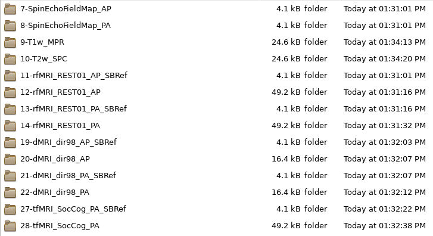
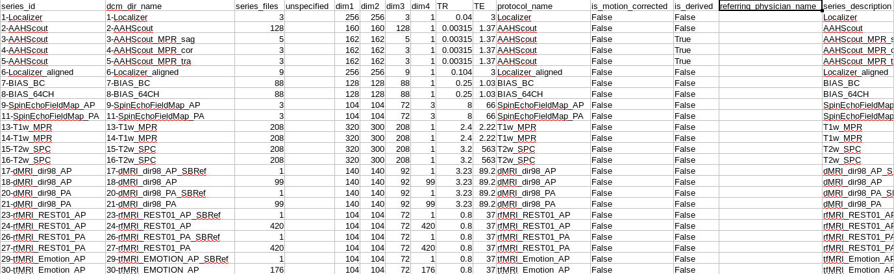
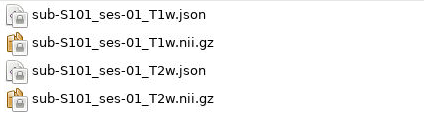
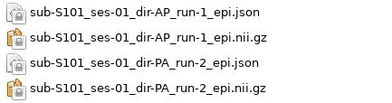
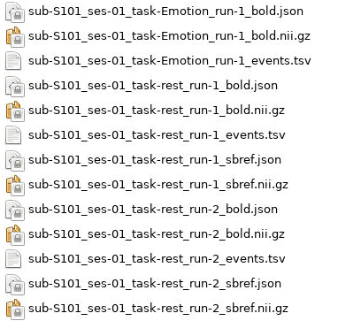
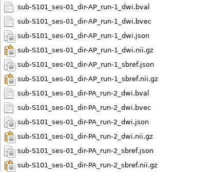

HeuDiConv
================================

HeuDiConv stands for Heuristic Dicom Converter and is a flexible pipeline for
converting DICOMs to a BIDS formatted data structure. Using dcm2niix, conversion
to the nifti formmat is fast and requires minimal user input. This document aims
to instruct users on how to install and use HeuDiConv on the Cheaha computing
cluster. HeuDiConv's full documentation is outdated but can be found `here for
further information <https://heudiconv.readthedocs.io/en/latest/index.html>`__.

Installation
-------------------------------

There are multiple methods to install Heudiconv including as a Python library or
as a standalone Singularity container. How you interface with Heudiconv changes
slightly based on how you install it, but both installation methods will be
covered here.

As a Python Library
^^^^^^^^^^^^^^^^^^^^^^^^^^^^^^^

First, load an Anaconda module on Cheaha and create a virtual environment. From
there, you can use ``pip`` to install the Heudiconv library like:

.. code-block:: bash

    module load Anaconda3/2020.11
    
    # create and/or activate your virtual environment here

    pip install heudiconv[all]

This will download the latest version of Heudiconv. After installation, you can
use the library through the ``heudiconv`` command.

In addition you will need to download the ``dcm2niix`` library to actually
convert from DICOM to nifti.

.. code-block:: bash

    conda install -c conda-forge dcm2niix

As a Container
^^^^^^^^^^^^^^^^^^^^^^^^^^^^^^^

Containers are stand-alone instances that provide all the necessary dependencies
for a given program out-of-the-box so no management of external programs is
required. Using this method, you will download a Singularity image file
containing Heudiconv and all of its dependencies in a single location in your
personal user space or a shared lab project space. More information on using
Singularity containers can be found at their `documentation
<https://sylabs.io/guides/3.8/user-guide/>`__.

In order to use Singularity on Cheaha, you will need to load the module. You
only need to load the module once when opening a new terminal window or in a job
submission script. The command to load the latest version of Singularity
installed on the cluster is:

.. code-block:: bash

    module load Singularity

To load a specific version, use ``module spider Singularity`` to view all
installed Singularity modules and load the one you want.

The container for Heudiconv can be found on their `DockerHub page
<https://hub.docker.com/r/nipy/heudiconv>`__, and the source code can be found
on their `github page <https://github.com/nipy/heudiconv>`__. Currently, the
latest working Singularity container is version 0.5.4.

To begin, open a terminal window on Cheaha either through the HPC Desktop portal
at `<rc.uab.edu>`__ or through your own personal VNC session. If you are working
through a personal VNC session, be sure to start an interactive session in your
terminal first to avoid running anything on the login node. 

To pull and build the latest version of Heudiconv, run the following commands:

.. code-block:: bash
    
    singularity build $USER_DATA/heudiconv-0.5.4.sif docker://nipy/heudiconv:0.5.4

This command will build Heudiconv version 0.5.4 from DockerHub, convert it to a
singularity image, and save it in your user data folder as heudiconv-0.5.4.sif.
Modify the output path as you see fit to save it where you need it. The download
and conversion process will take some time, so be patient while everything runs.

Initial Folder Structure
------------------------------------

Once the Singularity image has been downloaded, make sure your DICOM files are
organized consistently across the project you are converting. For instance, a
preferred organization is:

.. code-block:: text

    |-- dataset/
        |-- dicom
        |   |-- S101/
        |   |   |-- [ses-01/]
        |   |   |   |-- scan-01/
        |   |   |   |   |-- ***001.dcm
        |   |   |   |   |-- ***002.dcm
        |   |   |   |   |-- ...
        |   |   |   |
        |   |   |   |-- scan-02/
        |   |   |       |-- ***.dcm
        |   |   |
        |   |   |-- [ses-02/]
        |   |
        |   |-- S102/
        |   |
        |   |-- S103/
        |
        |-- nifti (empty)

Inclusion of the session directory level is optional if there is only one
session per participant. The names of the dicom files themselves do not need to
be altered in any way before running Heudiconv.

If your data is stored in a different format but has a consistent structure
across all files, this is fine. It is just important that the subject name as
well as session number (if multiple sessions were acquired) are easily extracted
from the file path.

Running HeuDiConv
-----------------------------------

In the following example, we will use the given directory structure above. The
dataset will be named ``D01``, and it's parent directory will be
``/data/project/genlab/datasets`` to mimic a generic project directory found on
Cheaha. 

Step 1: Generate Scan Info
^^^^^^^^^^^^^^^^^^^^^^^^^^^^^^^^^^^

.. note::
    If you already have a heuristic file to use with your dataset, skip to Step 3.

The first step in Heudiconv generates a hidden directory with information about
each scan found in the given subject and session folder you specify. This
information will be used to create what is called a heuristic file which will be
covered later.

**Python:**

.. code-block:: bash

    # set the base dataset directory
    BASE_DIR=/data/project/genlab/datasets/D01

    heudiconv -s S101 -ss 01 -d $BASE_DIR/dicom/{subject}/ses-{session}/*/*.dcm -o $BASE_DIR/nifti -f convertall -c none --overwrite

**Singularity:**

.. code-block:: bash

    singularity run --bind /data/project/genlab/datasets/D01:/base
    $USER_DATA/heudiconv-0.5.4.sif -s S101 -ss 01 -d
    /base/dicom/{subject}/ses-{session}/*/*.dcm -o /base/nifti/
    -f convertall -c none --overwrite

The command, broken down:

1. --bind gives Singularity access to the specified directory and shortens it to
   /base. This should be the full path to the dataset directory.
2. Give the path to the singularity Heudiconv image file. The path can be
   relative or absolute.
3. -s and -ss: specify the subject(s) and session(s) to process, respectively.
   These can either be a single entry or a list.
4. -d: the path to the dicom images for the given subject and session. {subject}
   and {session} in the path will be replaced by the -s and -ss values,
   respectively. If a list for either -s or -ss is given, this command will iterate
   through the list, automatically changing the {subject} and {session} values
   as needed. From there, glob syntax is used to find all the dicoms in all the
   scan folders (/*/*.dcm).
5. -o: the output directory
6. -f: the heuristic file to use, set to ``convertall`` here because a heuristic
   has not yet been generated.
7. -c: the converter to use. None here because we are only generating scan info,
   not yet converting
8. --overwrite: overwrite existing files.

The output of Step 1 is a hidden folder at the path
``$BASE_DIR/nifti/.heudiconv``. It will contain a folder for each participant
with a generic ``heuristic.py`` file and a ``dicominfo_ses-**.tsv`` file inside.
An example can be seen below:

.. image:: images/step1-out.png
    :width: 500
    :align: center
    :alt: Alternative Text

Copy these files to the base directory.

Step 2: Modify The Heuristic
^^^^^^^^^^^^^^^^^^^^^^^^^^^^^^^^^^^^

In order to correctly name and sort the different types of scans into their
proper folders, Heudiconv uses a user-generated file called a heuristic file
that controls how each scan is sorted into the BIDS framework. Because every
protocol uses different scans and tasks, the heuristic file is also different
across protocols. However, once one heuristic is created for a dataset, as long
as the scans do not change, the heuristic only needs to be created once. If
there is more than one session, and the scans change between sessions, one
heuristic for each unique session should be created.

If you open the ``heuristic.py`` in a text editor, it will look like this:

.. code-block:: python

   import os

   def create_key(template, outtype=('nii.gz',), annotation_classes=None):
       if template is None or not template:
           raise ValueError('Template must be a valid format string')
       return template, outtype, annotation_classes

   def infotodict(seqinfo):
       """Heuristic evaluator for determining which runs belong where

       allowed template fields - follow python string module:

       item: index within category
       subject: participant id
       seqitem: run number during scanning
       subindex: sub index within group
       """

       data = create_key('run{item:03d}')
       info = {data: []}
       last_run = len(seqinfo)

       for s in seqinfo:
           info[data].append(s.series_id)
       return info

The ``infotodict`` function is where edits will be made. The first is to create
keys for the various types of scans. These entries will be used to rename the
scans to be BIDS-compliant. Examples for T1w, rest BOLD, and a
spin-echo fieldmap can be see below.

.. code-block:: python

    # T1w
    t1 = create_key('sub-{subject}/ses-{session}/anat/sub-{subject}_T1w')

    # multiband resting state
    rest = create_key('sub-{subject}/ses-{session}/func/sub-{subject}_task-rest_run-{item:01d}_bold')
    rest_sbref = create_key('sub-{subject}/ses-{session}/func/sub-{subject}_task-rest_run-{item:01d}_sbref')
    
    # phase encoded spin-echo fieldmap
    fmap = create_key('sub-{subject}/ses-{session}/fmap/sub-{subject}_dir-{dir}_run-{item:01d}_epi')
    
The ``{item:01d}`` tag will automatically number multiple resting or task scans
within the same session based on acquisition order.    
    
In all cases, the names passed to the ``create_key`` function should be
templated to the BIDS format described in the :ref:`Example Name Formats`
section or on the main BIDS documentation.

So for example, you are mapping a session that collected a T1, T2, two multiband
resting state scans, one multiband emotion recognition task named Emotion, two
multiband diffusion scans, and a pair of spin-echo fieldmaps. A folder with
those scans could look like the following:

The section mapping those names to specific keys in the heuristic file would look like:

.. code-block:: python 

    def infotodict(seqinfo):
       """Heuristic evaluator for determining which runs belong where

       allowed template fields - follow python string module:

       item: index within category
       subject: participant id
       seqitem: run number during scanning
       subindex: sub index within group
       """

       t1 = create_key('sub-{subject}/{session}/anat/sub-{subject}_T1w')
       t2 = create_key('sub-{subject}/{session}/anat/sub-{subject}_T2w')
       fmap = create_key('sub-{subject}/{session}/fmap/sub-{subject}_dir-{dir}_run-{item:01d}_epi')
       rest = create_key('sub-{subject}/{session}/func/sub-{subject}_task-rest_run-{item:01d}_bold')
       emotion = create_key('sub-{subject}/{session}/func/sub-{subject}_task-Emotion_run-{item:01d}_bold')
       rest_sbref = create_key('sub-{subject}/{session}/func/sub-{subject}_task-rest_run-{item:01d}_sbref')
       emotion_sbref = create_key('sub-{subject}/{session}/func/sub-{subject}_task-Emotion_run-{item:01d}_sbref')
       dwi = create_key('sub-{subject}/{session}/dwi/sub-{subject}_dir-{dir}_run-{item:01d}_dwi')
       dwi_sbref = create_key('sub-{subject}/{session}/dwi/sub-{subject}_dir-{dir}_run-{item:01d}_sbref')

       info = {t1:[], t2:[], fmap:[], rest:[], emotion:[], rest_sbref:[], emotion_sbref:[], dwi:[], dwi_sbref:[]}

The last line initializes a ``dict`` python object used in the next section.
Include an entry for every scan type you named above it.

The following section loops through the scan directories and sorts the scans
into the initialized ``dict`` object. Here, you will create matching criteria
for each scan for a correct sort using info from the ``dicominfo_ses-**.tsv``
file copied earlier. If you open the tsv file, you will see something that looks
like:

This gives information taken from the dicom headers of each scan in the session.
Use it to create criteria to match the dicom scans to the keys created above.

For example, for the resting state BOLD, there are 420 volumes and the
``series_id`` field contains ``REST`` in it. No other scan type in this session
matches those qualities, so we can match on those fields. The matching command
for this would look like:

.. code-block:: python

    if (s.dim4 == 420) and ('REST' in s.series_id):
        info[rest].append({'item': s.series_id})

This will match any scans that have 420 volumes ``'REST'`` in their ID to the
``rest`` key we made earlier. In addition, because the ``rest`` key includes an
``item`` description in the value name, it appends the ``series_id`` for the
matched scan to the ``rest`` field in the ``info`` dictionary. Looking back at
the name, this will incrementally increase the run number for the scans with the
same name and acquisition parameters. If multiple fields need to be substituted
for in the value name (such as ``dir`` and ``run`` for the dwi scans), they are
both included as a comma-separated list in the ``append`` command.

For T1w and T2w scans where post-acquisition normalization occurs at the
scanner, two versions may be available for BIDS sorting. If you only want to
include the normalized version, match for ``'NORM'`` in the ``image_type``
field.

The full heuristic file for this example, including the matching criteria, can
be seen below:

.. code-block:: python
   
   import os

   def create_key(template, outtype=('nii.gz',), annotation_classes=None):
       if template is None or not template:
           raise ValueError('Template must be a valid format string')
       return template, outtype, annotation_classes

   def infotodict(seqinfo):
       """Heuristic evaluator for determining which runs belong where

       allowed template fields - follow python string module:

       item: index within category
       subject: participant id
       seqitem: run number during scanning
       subindex: sub index within group
       """

       t1 = create_key('sub-{subject}/{session}/anat/sub-{subject}_{session}_T1w')
       t2 = create_key('sub-{subject}/{session}/anat/sub-{subject}_{session}_T2w')
       fmap = create_key('sub-{subject}/{session}/fmap/sub-{subject}_{session}_dir-{dir}_run-{item:01d}_epi')
       rest = create_key('sub-{subject}/{session}/func/sub-{subject}_{session}_task-rest_run-{item:01d}_bold')
       rest_sbref = create_key('sub-{subject}/{session}/func/sub-{subject}_{session}_task-rest_run-{item:01d}_sbref')
       emotion = create_key('sub-{subject}/{session}/func/sub-{subject}_{session}_task-Emotion_run-{item:01d}_bold')
       emotion_sbref = create_key('sub-{subject}/{session}/func/sub-{subject}_{session}_task-Emotion_run-{item:01d}_sbref')
       dwi = create_key('sub-{subject}/{session}/dwi/sub-{subject}_{session}_dir-{dir}_run-{item:01d}_dwi')
       dwi_sbref = create_key('sub-{subject}/{session}/dwi/sub-{subject}_{session}_dir-{dir}_run-{item:01d}_sbref')

       info = {t1:[], t2:[], fmap:[], rest:[], emotion:[], rest_sbref:[], emotion_sbref:[], dwi:[], dwi_sbref:[]}

       for idx, s in enumerate(seqinfo):
           # match T1 and T2 scans. No appending due to only wanting a single of
           # each type
           if (s.dim3 == 208) and ('T1w' in s.protocol_name) and ('NORM' in s.image_type):
               info[t1] = [s.series_id]
           if (s.dim3 == 208) and ('T2w' in s.protocol_name) and ('NORM' in s.image_type):
               info[t2] = [s.series_id]
           
           # match phase-encoded fieldmaps including direction
           if (s.dim4 == 3) and ('SpinEchoFieldMap_AP' in s.protocol_name):
               info[fmap].append({'item': s.series_id, 'dir': 'AP'})
           if (s.dim4 == 3) and ('SpinEchoFieldMap_PA' in s.protocol_name):
               info[fmap].append({'item': s.series_id, 'dir': 'PA'})
           
           # match full functional scans
           if (s.dim4 == 176) and ('EMOTION' in s.dcm_dir_name):
               info[emotion].append({'item': s.series_id})
           if (s.dim4 == 420) and ('REST' in s.dcm_dir_name):
               info[rest].append({'item': s.series_id})
           
           # match full diffusion scans including direction
           if (s.dim4 == 99) and ('dMRI' in s.dcm_dir_name) and ('AP' in s.dcm_dir_name):
               info[dwi].append({'item': s.series_id, 'dir':'AP'})
           if (s.dim4 == 99) and ('dMRI' in s.dcm_dir_name) and ('PA' in s.dcm_dir_name):
               info[dwi].append({'item': s.series_id, 'dir':'PA'})
           
           # match diffusion SBRef including direction to match the full dwi
           # scan names
           if (s.dim4 == 1) and ('dMRI' in s.dcm_dir_name) and ('SBRef' in s.dcm_dir_name) and ('AP' in s.dcm_dir_name):
               info[dwi_sbref].append({'item': s.series_id, 'dir':'AP'})
           if (s.dim4 == 1) and ('dMRI' in s.dcm_dir_name) and ('SBRef' in s.dcm_dir_name) and ('PA' in s.dcm_dir_name):
               info[dwi_sbref].append({'item': s.series_id, 'dir':'PA'})
           
           # match functional SBRef
           if (s.dim4 == 1) and ('REST' in s.dcm_dir_name) and ('SBRef' in s.dcm_dir_name):
               info[rest_sbref].append({'item': s.series_id})
           if (s.dim4 == 1) and ('Emotion' in s.dcm_dir_name) and ('SBRef' in s.dcm_dir_name):
               info[emotion_sbref].append({'item': s.series_id})
       return info

       for s in seqinfo:
           info[data].append(s.series_id)
       return info

From here, you can delete the tsv file as it is no longer necessary.

Step 3: BIDS Conversion
^^^^^^^^^^^^^^^^^^^^^^^^^^^^^^^^^^

The next step is performing the conversion. The commands for this look very
similar to those in Step 1, but have a couple of options changed. These can be
seen below.

**Python:**

.. code-block:: bash

    # set the base dataset directory
    BASE_DIR=/data/project/genlab/datasets/D01

    heudiconv -s S101 -ss 01 -d $BASE_DIR/dicom/{subject}/ses-{session}/*/*.dcm
    -o $BASE_DIR/nifti -f $BASE_DIR/heuristic.py -c dcm2niix -b --overwrite

**Singularity:**

.. code-block:: bash

    singularity run --bind /data/project/genlab/datasets/D01:/base
    $USER_DATA/heudiconv-0.5.4.sif -s S101 -ss 01 -d
    /base/dicom/{subject}/ses-{session}/*/*.dcm -o /base/nifti/
    -f $BASE_DIR/heuristic.py -c dcm2niix -b --overwrite

The changes are ``-f`` which now points to the new heuristic file, ``-c`` which
specifies ``dcm2niix`` as the converter, and ``-b`` which sets the output to be
in BIDS format.

The output file structure for the ``anat``, ``fmap``, ``func``, and ``dwi``
folders can be seen below.

**D01/nifti/sub-S101/ses-01/anat:**

---------------

**D01/nifti/sub-S101/ses-01/fmap:**

---------------

**D01/nifti/sub-S101/ses-01/func:**

---------------

**D01/nifti/sub-S101/ses-01/dwi:**

Step 4: Cleanup
^^^^^^^^^^^^^^^^^^^^^^^^^^^^^^^^^^

The last step involves removing an unnecessary field from a json file that could
cause BIDS validation to fail (depending on which Heudiconv version you are
using) as well as associating the field map files with the functional and
diffusion scans they should be applied to during distortion correction.

First, each type of functional scan will have an associated ``*_bold.json`` file
in the main ``nifti`` folder. Open it in a json file editor such as Atom
(available in Applications > Accessories on Cheaha) or VScode. Remove the
"CogAtlasID" field if its entry is only "TODO". For later versions of Heudiconv,
it is in an acceptable form of a URL so can be left alone.

Lastly, you need to associate the fieldmaps with their corresponding scans. This
can be done manually or through a custom script. For the manual process, open
the json sidecar file for one of the fieldmaps. You will need to add an
``IntendedFor`` field to the json file with its values being relative paths to
the associated functional and/or diffusion files. This field can be placed
anywhere in the json file and should look like:

.. code-block:: text

    "IntendedFor": [
        func/func_scan_1.nii.gz
        func/func_scan_2.nii.gz
    ]

Replace the generic names with the real names of the nifti files. Every fmap
file needs to have an ``IntendedFor`` field in order to be used for unwarping in
fmriprep or other similar BIDS apps. For sessions where multiple fieldmaps were
acquired for separate sets of scans, the ``IntendedFor`` fields will differ and
care should be taken to make sure the field maps are associated with the correct
scans.

Last Steps and Documentation
------------------------------------

While the output of Heudiconv is a BIDS-compliant dataset and can be used
immediately, files such as the dataset_description.json, the main task jsons,
and the participant tsv and json files are not automatically filled out.
Additionally, while the individual events.json files for each individual task
scan are generated, they will need to be filled out by the researcher. More
information about the task events files can be found `here <https://bids-specification.readthedocs.io/en/stable/04-modality-specific-files/05-task-events.html>`__.

