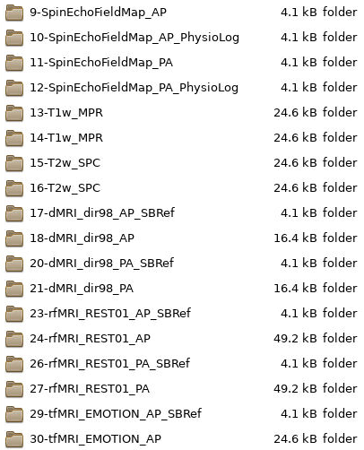
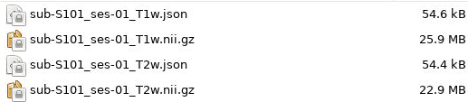
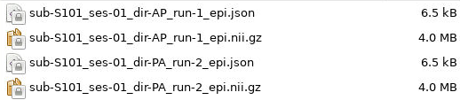
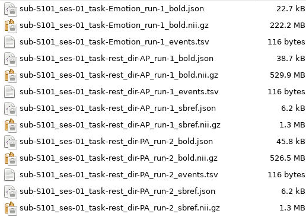
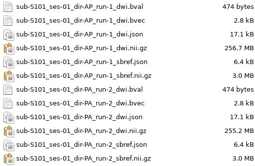

Example Use of HeuDiConv
==========================

In the following example, we will use the given directory structure above. The
dataset will be named ``D01``, and it's parent directory will be
``/data/project/genlab/datasets`` to mimic a generic project directory found on
Cheaha. When running this tool, be sure to change any paths and folder or
subject names to match your dataset.

Here, we are mapping a session that collected a T1, T2, two multiband
resting state scans, one multiband emotion recognition task named Emotion, two
multiband diffusion scans, and a pair of spin-echo fieldmaps. A folder with
those scans could look like the following:

Every multiband scan will have a corresponding SBRef scan that will also need to
be accounted for in the key.

Step 1: Generate Scan Info
--------------------------

The first step is to generate the scan info to match to. We can assign our
dataset directory path to ``BASE_DIR`` for to make the command easier to type
and more succinct.

.. code-block:: bash

    # set the base dataset directory
    BASE_DIR=/data/project/genlab/datasets/D01

    heudiconv -s S101 -ss 01 -d $BASE_DIR/dicom/{subject}/ses-{session}/*/*.dcm
    -o $BASE_DIR/nifti -f convertall -c none --overwrite
    
Step 2: Example Heuristic
-------------------------

Anatomicals
^^^^^^^^^^^

We have one T1w and one T2w scan, both of which have raw and normalized
versions. In our case, we only want to convert the normalized versions. Our key
for the anatomicals will be basic, only including the subject and session as
variable. The keys will look like:

.. code-block:: python
    
    t1 = create_key('sub-{subject}/{session}/anat/sub-{subject}_{session}_T1w')
    t2 = create_key('sub-{subject}/{session}/anat/sub-{subject}_{session}_T2w')
        
Next, we can determine the ``if`` statements for associating the keys with the
``info`` dictionary. Since we only want to use one T1w and one T2w, we can just
assign the series ID directly to the ``info`` dictionary. We will match on the
number of acquired slices, the ``T?w`` portion of the protocol name to
differentiate between T1w and T2w, and 'NORM' in the image_type so that we
choose the normalized scans. These ``if`` statements that go in the association
loop will look like:

.. code-block:: python

    if (s.dim3 == 208) and ('T1w' in s.protocol_name) and ('NORM' in s.image_type):
        info[t1] = [s.series_id]
    if (s.dim3 == 208) and ('T2w' in s.protocol_name) and ('NORM' in s.image_type):
        info[t2] = [s.series_id]

It is possible to use multiple T1w and T2w scans, although the keys and
association statements would need to be amended to include run information.
Examples of this can be seen in the :ref:`Functionals`, :ref:`Field Maps`, and :ref:`Diffusion` sections.

Field Maps
^^^^^^^^^^

We have two field maps taken in the AP and PA directions. In order to create a
sufficient key, we will need to add the direction information to the key and
association sections. Additionally, we can add run information in case some
subjects have multiple fieldmaps. Our key for Spin Echo field maps will be:

.. code-block:: python

    fmap = create_key('sub-{subject}/{session}/fmap/sub-{subject}_{session}_dir-{dir}_run-{item:01d}_epi')

Since we are accounting for the possiblity of multiple field maps in the same
direction, we will use the ``append`` method instead of direct assignment to the
``info`` dictionary. The field map association statement will look like:

.. code-block:: python

    if (s.dim4 == 3) and ('SpinEchoFieldMap_AP' in s.protocol_name):
        info[fmap].append({'item': s.series_id, 'dir':'AP'})
    if (s.dim4 == 3) and ('SpinEchoFieldMap_PA' in s.protocol_name):
        info[fmap].append({'item': s.series_id, 'dir':'PA'})

We chose to match on the fact each field map has 3 volumes and contains
SpinEchoFieldMap in the protocol_name. There is a split based on which direction
the field map was acquired in which changes the ``dir`` field.

Functionals
^^^^^^^^^^^

We have multiple resting state scans as well as an emotion recognition task
scan. We will create separate keys and association statements for both of these
types of scans. Because there are multiple resting state scans acquired in
multiple directions, we will include direction and run information in the
``rest`` key. 

Additionally, because these are multiband scans, there are SBRef volumes
associated with both scan types. An SBRef key should be made alongside each BOLD
scan type.

.. code-block:: python

    rest = create_key('sub-{subject}/{session}/func/sub-{subject}_{session}_task-rest_dir-{dir}_run-{item:01d}_bold')
    rest_sbref = create_key('sub-{subject}/{session}/func/sub-{subject}_{session}_task-rest_dir-{dir}_run-{item:01d}_sbref')
    
    emotion = create_key('sub-{subject}/{session}/func/sub-{subject}_{session}_task-Emotion_run-{item:01d}_bold')
    emotion_sbref = create_key('sub-{subject}/{session}/func/sub-{subject}_{session}_task-Emotion_run-{item:01d}_sbref')

You can see that the only difference between the BOLD scans and their SBRef keys
is that the ``bold`` tag at the end of the scan has been changed to ``sbref``.
The rest of the name should be exactly the same.

In the same way as the field maps, we will include run number for both rest and
Emotion keys and direction information for the rest key and association
statements. 

.. code-block:: python

    # match REST scans and their SBRefs
    if (s.dim4 == 420) and ('REST' in s.dcm_dir_name) and ('AP' in s.dcm_dir_name):
        info[rest].append({'item': s.series_id, 'dir': 'AP'})
    if (s.dim4 == 420) and ('REST' in s.dcm_dir_name) and ('PA' in s.dcm_dir_name):
        info[rest].append({'item': s.series_id, 'dir': 'PA'})
    if (s.dim4 == 1) and ('REST' in s.dcm_dir_name) and ('AP' in s.dcm_dir_name):
        info[rest_sbref].append({'item': s.series_id, 'dir':'AP'})
    if (s.dim4 == 1) and ('REST' in s.dcm_dir_name) and ('PA' in s.dcm_dir_name):
        info[rest_sbref].append({'item': s.series_id, 'dir':'PA'})    
    
    
    # match Emotion scans and their SBRefs
    if (s.dim4 == 176) and ('EMOTION' in s.dcm_dir_name):
        info[emotion].append({'item': s.series_id})
    if (s.dim4 == 1) and ('Emotion' in s.dcm_dir_name) and ('SBRef' in s.dcm_dir_name):
        info[emotion_sbref].append({'item': s.series_id})

For resting state scans, we matched on having REST in the name and the direction
the scan was acquired in. We also matched based on the number of volumes to
differentiate between the BOLD scans and their SBRefs. The direction information
was The same thing was done
for the Emotion scan and its SBRef minus the direction information.

The full heuristic file for this example, including the matching criteria, can
be seen below:

.. code-block:: python
   
    import os

    def create_key(template, outtype=('nii.gz',), annotation_classes=None):
        if template is None or not template:
            raise ValueError('Template must be a valid format string')
        return template, outtype, annotation_classes

    def infotodict(seqinfo):
        """Heuristic evaluator for determining which runs belong where

        allowed template fields - follow python string module:

        item: index within category
        subject: participant id
        seqitem: run number during scanning
        subindex: sub index within group
        """
        
        ########################## Scan Keys ##############################
        t1 = create_key('sub-{subject}/{session}/anat/sub-{subject}_{session}_T1w')
        t2 = create_key('sub-{subject}/{session}/anat/sub-{subject}_{session}_T2w')
        fmap = create_key('sub-{subject}/{session}/fmap/sub-{subject}_{session}_dir-{dir}_run-{item:01d}_epi')
        rest = create_key('sub-{subject}/{session}/func/sub-{subject}_{session}_task-rest_dir-{dir}_run-{item:01d}_bold')
        rest_sbref = create_key('sub-{subject}/{session}/func/sub-{subject}_{session}_task-rest_dir-{dir}_run-{item:01d}_sbref')
        emotion = create_key('sub-{subject}/{session}/func/sub-{subject}_{session}_task-Emotion_run-{item:01d}_bold')
        emotion_sbref = create_key('sub-{subject}/{session}/func/sub-{subject}_{session}_task-Emotion_run-{item:01d}_sbref')
        dwi = create_key('sub-{subject}/{session}/dwi/sub-{subject}_{session}_dir-{dir}_run-{item:01d}_dwi')
        dwi_sbref = create_key('sub-{subject}/{session}/dwi/sub-{subject}_{session}_dir-{dir}_run-{item:01d}_sbref')

        info = {t1:[], t2:[], fmap:[], rest:[], emotion:[], rest_sbref:[], emotion_sbref:[], dwi:[], dwi_sbref:[]}

        ################# Associate Keys with Scans #######################
        for idx, s in enumerate(seqinfo):
            # match T1 and T2 scans. No appending due to only wanting a single
            # of each type
            if (s.dim3 == 208) and ('T1w' in s.protocol_name) and ('NORM' in s.image_type):
                info[t1] = [s.series_id]
            if (s.dim3 == 208) and ('T2w' in s.protocol_name) and ('NORM' in s.image_type):
                info[t2] = [s.series_id]
           
            # match phase-encoded fieldmaps including direction
            if (s.dim4 == 3) and ('SpinEchoFieldMap_AP' in s.protocol_name):
                info[fmap].append({'item': s.series_id, 'dir': 'AP'})
            if (s.dim4 == 3) and ('SpinEchoFieldMap_PA' in s.protocol_name):
                info[fmap].append({'item': s.series_id, 'dir': 'PA'})
           
            # match full functional scans including direction for the REST scans
            if (s.dim4 == 420) and ('REST' in s.dcm_dir_name) and ('AP' in s.dcm_dir_name):
                info[rest].append({'item': s.series_id, 'dir': 'AP'})
            if (s.dim4 == 420) and ('REST' in s.dcm_dir_name) and ('PA' in s.dcm_dir_name):
                info[rest].append({'item': s.series_id, 'dir': 'PA'})
            if (s.dim4 == 176) and ('EMOTION' in s.dcm_dir_name):
                info[emotion].append({'item': s.series_id})
            
            # match functional SBRefs
            if (s.dim4 == 1) and ('REST' in s.dcm_dir_name) and ('AP' in s.dcm_dir_name):
                info[rest_sbref].append({'item': s.series_id, 'dir':'AP'})
            if (s.dim4 == 1) and ('REST' in s.dcm_dir_name) and ('PA' in s.dcm_dir_name):
                info[rest_sbref].append({'item': s.series_id, 'dir':'PA'})
            if (s.dim4 == 1) and ('Emotion' in s.dcm_dir_name) and ('SBRef' in s.dcm_dir_name):
                info[emotion_sbref].append({'item': s.series_id})
           
            # match full diffusion scans including direction
            if (s.dim4 == 99) and ('dMRI' in s.dcm_dir_name) and ('AP' in s.dcm_dir_name):
                info[dwi].append({'item': s.series_id, 'dir':'AP'})
            if (s.dim4 == 99) and ('dMRI' in s.dcm_dir_name) and ('PA' in s.dcm_dir_name):
                info[dwi].append({'item': s.series_id, 'dir':'PA'})
           
            # match diffusion SBRef including direction to match the full dwi
            # scan names
            if (s.dim4 == 1) and ('dMRI' in s.dcm_dir_name) and ('AP' in s.dcm_dir_name):
                info[dwi_sbref].append({'item': s.series_id, 'dir':'AP'})
            if (s.dim4 == 1) and ('dMRI' in s.dcm_dir_name) and ('PA' in s.dcm_dir_name):
                info[dwi_sbref].append({'item': s.series_id, 'dir':'PA'})

        return info

        for s in seqinfo:
            info[data].append(s.series_id)
        return info

Example BIDS Dataset
--------------------

The output file structure for the ``anat``, ``fmap``, ``func``, and ``dwi``
folders can be seen below.

**D01/nifti/sub-S101/ses-01/anat:**

---------------

**D01/nifti/sub-S101/ses-01/fmap:**

---------------

**D01/nifti/sub-S101/ses-01/func:**

---------------

**D01/nifti/sub-S101/ses-01/dwi:**

